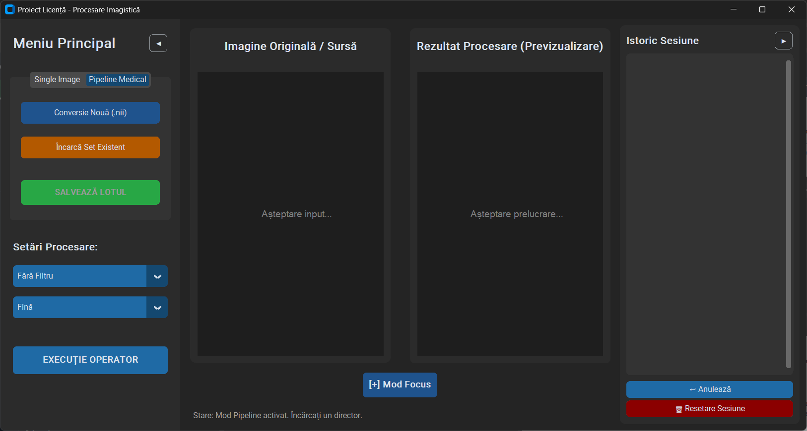
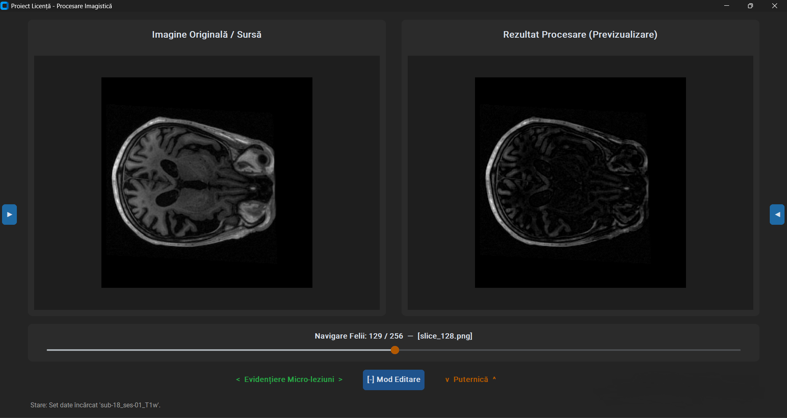
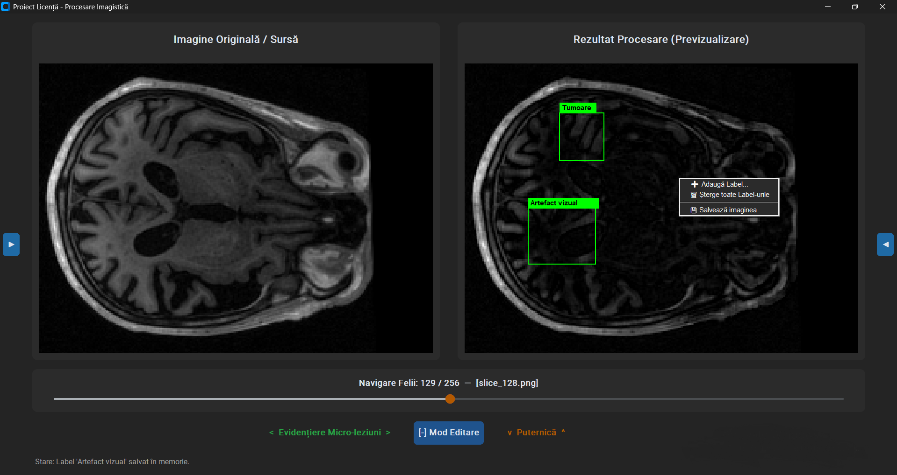

# Sistem de Procesare și Analiză Morfologică pentru Imagistică Medicală 3D

O aplicație desktop avansată, dezvoltată în Python, concepută pentru vizualizarea, decodificarea și procesarea volumelor de date medicale 3D (în format NIfTI) utilizând tehnici fundamentale și avansate de **Morfologie Matematică**. 

Proiectul este optimizat pentru preprocesarea imaginilor obținute prin Rezonanță Magnetică (RMN / MRI), oferind suport critic în izolarea structurilor anatomice complexe, reducerea zgomotului de fond și facilitarea segmentării formațiunilor tumorale. Aplicația utilizează o arhitectură modulară decuplată (Core-GUI), asigurând o viteză ridicată de procesare prin mecanisme de caching direct în memoria RAM (In-Memory Processing).



---

## 🚀 Caracteristici Principale

### 1. Vizualizare și Procesare Volumetrică (Batch Processing)
* **Decodificare NIfTI (.nii, .nii.gz):** Extracția automată a cadrelor axiale 2D din volume medicale tridimensionale (ex: seturi de date oncologice/neurologice).
* **Procesare Secvențială în RAM:** Execuția operatorilor direct pe lotul de imagini din memorie, eliminând latențele de scriere/citire pe disc.
* **Sistem de Navigare Sincronizată:** Slider interactiv pentru parcurgerea cadrelor anatomice cu actualizarea instantanee a previzualizării procesate.

### 2. Mod Focus & Live Preview (Accelerare UI)
* **Navigare din Tastatură:** Posibilitatea de a schimba operatorii (Stânga/Dreapta) și intensitățile (Sus/Jos) direct din săgeți.
* **Procesare "Din Zbor":** Aplicația randează rezultatul vizual instantaneu, fără a încărca stiva de memorie, permițând o explorare rapidă a filtrelor.
* **Modul "Hold to Compare":** Funcționalitate avansată la apăsarea tastei SPACE pentru comutarea rapidă între imaginea originală și previzualizarea filtrului curent.



### 3. Sistem Avansat de Adnotare Medicală (Labeling)
* **Bounding Boxes:** Desenare interactivă de chenare direct pe planșa procesată (cu transformări matematice precise la Zoom/Pan).
* **Meniu Contextual Dinamic:** Identificarea chenarelor la click-dreapta pentru ștergere individuală sau adăugare de noi etichete medicale.
* **Export cu Overlay:** Salvarea cadrelor de interes cu adnotările și textul suprapuse direct pe matricea de pixeli, utile pentru rapoarte clinice.



### 4. Istoric de Operații (Stacking Pipeline)
* Construirea de pipeline-uri complexe (ex: Deschidere → Eroziune → Top-Hat).
* Reordonarea filtrelor prin **Drag & Drop** cu recalcularea automată a rezultatului vizual.
* Suport integrat pentru `Undo` și resetare de sesiune.

---

## ⚙️ Instalare și Configurare

Aplicația necesită **Python 3.9** sau o versiune superioară. Se recomandă utilizarea unui mediu virtual pentru izolarea dependențelor.

1. **Deschiderea terminalului:** Navigați în directorul principal al proiectului.
2. **Crearea mediului virtual:** Rulați comanda `python -m venv venv` (sau `python3 -m venv venv` în funcție de sistemul de operare).
3. **Activarea mediului virtual:** Rulați `venv\Scripts\activate` (pe Windows) sau `source venv/bin/activate` (pe macOS/Linux).
4. **Instalarea pachetelor necesare:** Rulați comanda `pip install -r requirements.txt` pentru a instala biblioteca OpenCV, CustomTkinter, NiBabel și restul dependențelor.
5. **Lansarea aplicației:** Porniți platforma rulând comanda `python main.py`.

---

## 📖 Ghid de Utilizare

1. **Încărcarea Datelor:** Din meniul principal (stânga), selectați secțiunea `Pipeline Medical` pentru a încărca volume 3D (.nii / .nii.gz). Apăsați `Conversie Nouă` pentru a extrage cadrele axiale în memorie. Pentru o singură imagine de test, utilizați tab-ul `Single Image`.
2. **Navigarea Spațială:** Folosiți slider-ul central pentru a parcurge secțiunile anatomice. Utilizați rotița de scroll a mouse-ului pentru Zoom și click-stânga menținut apăsat pentru Panning (navigare pe imaginea mărită).
3. **Aplicarea Filtrelor:** Din panoul `Setări Procesare`, alegeți filtrul dorit (ex: Deschidere, Top-Hat) și dimensiunea elementului structurant. Apăsați `EXECUȚIE OPERATOR` pentru a-l adăuga în stiva de procesare.
4. **Reordonarea Istoricului:** Trageți și plasați (Drag & Drop) operațiile în panoul `Istoric Sesiune` pentru a schimba ordinea de execuție. Imaginea se va actualiza automat.
5. **Utilizarea Modului Focus:** Apăsați butonul `[+] Mod Focus` pentru a ascunde panourile laterale. Folosiți săgețile de la tastatură pentru a naviga cadrele și tasta `SPACE` (ținută apăsat) pentru a compara imaginea procesată cu originalul, `ENTER`  pentru a salva rezultatul curent în RAM.
6. **Adnotarea (Labeling):** Faceți click-dreapta pe panoul de previzualizare procesat, selectați `Adaugă Label`, trasați un chenar peste zona patologică și asignați-i o etichetă (ex: Tumoare, Edem).
7. **Exportul Rezultatelor:** Salvați imaginea curentă cu adnotări (click-dreapta -> Salvează imaginea) sau exportați întregul lot de cadre procesate din RAM direct pe stocarea locală folosind butonul `Salvează Lotul`.

---

## 🔬 Operatori Morfologici Implementați

* **Eroziune & Dilatare:** Operatori fundamentali pentru subțierea sau expandarea regiunilor de interes.
* **Deschidere & Închidere:** Eliminarea artefactelor izolate și umplerea golurilor structurale interne fără a afecta aria globală.
* **Top-Hat & Black-Hat:** Extracția elementelor luminoase/întunecate, excelentă pentru corecția de contrast pe fonduri neuniforme.
* **Gradient Morfologic:** Conturarea precisă a marginilor tumorale sau ale structurilor osoase.
* **Kernel Ajustabil:** Suport pentru elemente structurante pătratice dinamice (dimensiuni impare 3x3, 5x5, 7x7).

---
## 📊 Evaluare Cantitativă și Benchmark

Pentru a valida eficiența și acuratețea algoritmilor morfologici în afara limitărilor interfeței grafice, proiectul include un modul dedicat de benchmark. Acesta evaluează:
* **Performanța Computațională:** Timpul de execuție per cadru (în ms) și consumul maxim de memorie RAM (în MB) utilizând modulul `tracemalloc`.
* **Performanța Arhitecturală (I/O):** Compararea latențelor de sistem între arhitectura *In-Memory Cache* și salvarea clasică pe partiția de stocare (SSD).
* **Calitatea Imaginii (Acuratețea Diagnostică):** Algoritmii sunt evaluați folosind metrici standard din industrie — **PSNR** (Peak Signal-to-Noise Ratio) și **SSIM** (Structural Similarity Index Measure).

**Rularea testelor locale:**
Pentru a genera rezultatele de evaluare calitativă și timpii de latență, rulați:
```bash
python tests/benchmark_teste.py
python tests/benchmark_ram_vs_disk.py
```
---

## 🛠️ Tehnologii și Arhitectură

Aplicația respectă principiile *Separation of Concerns*, având logica algoritmică strict separată de interfața grafică.

* **Limbaj:** Python 3.9+
* **Interfață Grafică (GUI):** `customtkinter` (Dark Mode, hardware acceleration, HighDPI support).
* **Procesare Matematică & Vision:** `OpenCV` (CV2) și `NumPy` pentru calcule de înaltă performanță pe matrice.
* **Manipulare și Randare Imagine:** `Pillow` (PIL) pentru adaptarea matricelor la UI cu resampling `NEAREST` pentru menținerea fidelității clinice la zoom.
* **Date Medicale:** `NiBabel` pentru parsarea voxelilor din fișiere `.nii` / `.nii.gz`.
* **Analiză & Metrică:** `scikit-image` pentru generarea benchmark-urilor matematice.

### Structura Proiectului
```text
Licenta_Morfologie/
│
├── main.py                  # Punctul de intrare (Entry-point) în aplicație
├── core/                    # Logica de business și date (Backend)
│   ├── backend_morph.py     # Algoritmi morfologici, parsare NIfTI, RAM caching
│   └── models.py            # Structuri de date (ex: definiția operațiilor)
│
├── gui/                     # Interfața Grafică (Frontend)
│   ├── app.py               # Fereastra principală, randare canvas, evenimente
│   ├── config.py            # Hărți clinice, setări constante
│   └── dialogs.py           # Pop-up-uri și input-uri personalizate
│
├── data_pipeline/           # Scripturi utilitare
│   └── convert_nii.py       # Convertor standalone CLI pentru volume 3D
│
├── tests/                   # Evaluare de performanță și testare
│   ├── benchmark_teste.py       # Benchmark calitativ (PSNR, SSIM, RAM)
│   └── benchmark_ram_vs_disk.py # Benchmark arhitectural (I/O Latență)
│
├── datasets/                # Stocare (ignorat în versionare)
│   ├── raw_3d/              # Volumele originale
│   ├── converted_2d/        # Cadrele 2D extrase (input)
│   └── processed_2d/        # Seturile de date salvate definitiv
│
└── requirements.txt         # Dependențele externe
```